# Abstract<a id="abstract"></a>

Querying images has traditionally been implemented using metadata of an image, where images are not treated as first class citizens in a database. This approach depends solely on how well an image has been tagged by a human user. In this project we aim to change the status quo by also including the images itself in the search process. At its core, our project focuses on looking at an image to extract relevant features, which in turn can be used to generate textual descriptions of the image. We then compute various similarity measures between these textual descriptions and a user provided query to return the most relevant images. We then extend this system to search similar images given an input image.

# Introduction<a id="introduction"></a>

Image search using textual description is a very powerful tool with numerous applications. In contrast to the traditional setting, where image retrieval is performed by looking up metadata, we propose to build a system that can query an image by using its features to generate a textual description. Writing metadata for a ever-growing set of images is an intractable task. In most cases the images either don't have metadata or have incorrect metadata. This project aims to break that dependency and use the implicit information within the image for retrieval.

Our model is built on an image captioning system and computing various similarity measures to fetch images based on the closeness between textual query and generated image captions. In this project we have used two architectures, one is called vanilla architecture where we use a CNN-encoder to generate image features and a LSTM model as decoder, and second is attention architecture where we again use a CNN-encoder to generate image features and an attention based LSTM model as decoder. We will go into details of both these architectures in subsequent sections. We are using COCO and Flickr8k datasets, both these datasets provide 5 human generated captions per image. The main modules that are implemented in this project are:

1.  Implemented both vanilla and attention architectures, and tested both the architectures on various hyper-parameters.

2.  Implemented a module to compute BLEU score of both vanilla and attention architecture on COCO and Flickr8k datasets.

3.  We have developed an weighted cosine-similarity mechanism by computing the cosine-similarity between embeddings of textual query and generated captions and weighting them with inverse word frequency to fetch top 5 relevant images.

4.  Implemented an REST-API architecture to query images.

5.  Extended the image search system to search based on images instead of the textual description.

# Related Work<a id="related-work"></a>

**Deep Fragment Embeddings for Bidirectional Image Sentence Mapping**: Our initial inspiration for image retrieval from came from [Deep fragment embeddings](http://arxiv.org/abs/1406.5679). Here the authors use a object detection model to extract fragments of images (objects). They also extract fragments of sentences. Fragments from both images and sentences are embedded in a common embedding space and explicitly reasons about their latent, inter-modal correspondences. They use a cosine-similarity based loss function where they take embeddings from image space and sentence space compute there dot product.

Our project is based on a similar approach but instead of comparing common embeddings from images and sentences we use a image captioning system to generate novel captions for an images and then use those captions to compute similarity between the given query. Our loss function (weighted-cosine similarity) is similar to their loss function, but differs in the fact that they compute fragment level loss whereas we compute a global loss.

# Methodology<a id="methodology"></a>

At core of our project we use an image captioning model to generate captions for an image, then we store those captions in a database. Then on being provided with a textual query we iterate over all the generated captions in the database, compute the various similarity metrics between the user textual query and generated captions and finally return the images with top5 similarity scores. We have used two datasets - Flickr8k and COCO , to evaluate our model. Both these datasets provide 5 user generated captions per image. In subsequent section we will go over various architecture that we experimented with in our captioning model.

## Image Captioning Model<a id="image-captioning-model"></a>

### Vanilla CNN-LSTM network<a id="vanilla-cnn-lstm-network"></a>

The vanilla architecture uses a pretrained Resnet50 model to encode the image features. These features are concatenated with the embeddings of true captions and fed to a single layered Long Short Term Memory (LSTM) network. The embedding and LSTM layers are trained from scratch. The outputs of the trained LSTM are used to generate the predicted captions.

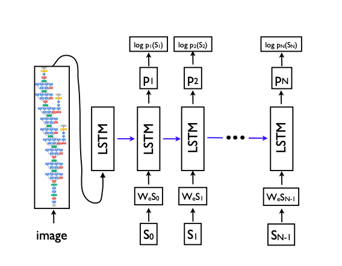

### CNN-LSTM with attention<a id="cnn-lstm-with-attention"></a>

In this architecture we use an attention mechanism in a single layered LSTM to give attention to image features along with previous generated word. The approach is taken from the paper "Show, attend and tell" . We use a pretrained Resnet101 model to generate image features. At each step of LSTM the image features and the last hidden state of LSTM is passed through an attention layer. The output of the attention layer is concatenated with the embeddings of the word generated in last step of LSTM to generate the current word.

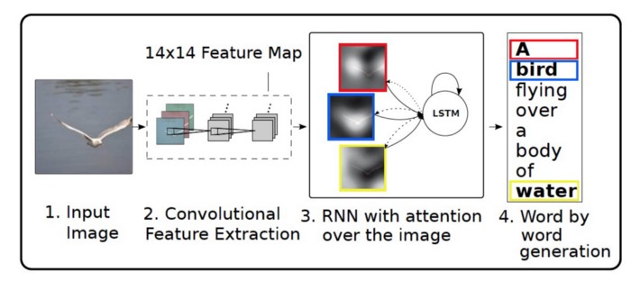

### CNN-LSTM with attention using BERT embedding<a id="cnn-lstm-with-attention-using-bert-embedding"></a>

In this variant, we used our attention CNN-LSTM network along with a pretrained BERT embedding layer instead of training the embedding layer from scratch. The pretrained BERT model already has learnt language embeddings over a large dataset and has proven to be successful in many downstream language tasks. We load the pretrained weights in the embedding layer and then fine-tune it for our own down stream task.

## Caption Generation and Search API<a id="caption-generation-and-search-api"></a>

### Textual search<a id="textual-search"></a>

We use beam search to sample top five predictions for each image in our test set and saved these to an Sqlite database. Now when a textual query is provided we iterate over all the images in the database and compute the similarity between the embeddings of textual query and each of the 5 generated captions for a particular image and store the max value. After iterating over all the images we return the images with top 5 similarity scores. To compute the similarity we experiment with two metrics, BLEU-score and weighted cosine similarity between embedded captions and query. Details of both these similarity metrics will be covered in a later section. To generate the embeddings we have experimented with two variants:

1.  We generate embeddings using the embedding layer that was trained from scratch during the training process.

2.  We use the pre-trained BERT model's embedding layer and further train it and use it to generate the embeddings.

### Similar image search<a id="similar-image-search"></a>

We then extended the above textual search to search for similar images, given an input image. To do this we first generate the caption of the input image and then use the above search mechanism to produce the related images. The quality of the produced results directly depends on the image captioning system and this corroborates with the outputs we observed in our experiments.

# Experiments<a id="experiments"></a>

We experiment with two datasets: Flickr8k and COCO.

**Flickr8k** contains 8,091 images collected from Flickr. The dataset in composed of images depicting people and animals doing various activities. Each image consist of 5 human generated captions. We use publicly available splits for train, validation and test sets. Validation and train sets consists of 1000 images each.

**COCO** is the largest image captioning dataset, containing 118,000, 5,000 and 40,670 images for training, validation and test respectively. This dataset is more challenging, since most images contain multiple objects in the context of complex scenes. Each image has 5 human annotated captions. To ease our training and evaluation times, we use 30000 images from the training set for training, 1000 images from the validation set for validation and 1500 images from the withheld validation set for testing.

**Pre-processing** We truncate captions longer than 40 words for COCO and for Flickr8k. We then build a vocabulary of words that occur at least 5 times in the training set, resulting in 11372 and 3005 words for COCO and Flickr8k respectively. When using pretrained bert-embeddings, we use bert tokenizer which has a vocabulary size of 30,522.

**Hyper-Paramters:** We use the following hyper-parameters to train our model:

-   **Learning Rate**: 0.001, **Batch Size**: 128, **Optimizer**: ADAM, **Momentum**: 0.9, **Weight Decay**: 0.99, **Scheduler Weight Decay**: 0.95, **Dropout**: 0.5

-   **Embedding Size**: 512, **Hidden Size**: 512, **Image Feature Size**: 2048, **Attention vector Size**: 512, **Encoded Image Size**: 14

**Compared Approaches:** For offline evaluation on Flickr8k and COCO , we compare the following models in this project:

-   Vanilla Model (Vanilla CNN-LSTM), In this model we use features generated by Resnet50 CNN model and pass it to a LSTM model to predict output words.

-   Attention model (CNN-LSTM with Attention) which uses a hard attention mechanism to predict words in LSTM decoder.

-   Attention model with BERT embeddings. In this model we train our CNN-LSTM with Attention model with pre-trained BERT embeddings and also fine tune the embedding layer.

The goal of this comparison is to verify that the improvements are caused specifically by the attention mechanism and BERT embeddings, and are not the result of orthogonal contributions (e.g. better CNN features or better optimization). We further compare our method with Adaptive Attention , Google NIC and Hard-Attention .

# Results<a id="results"></a>

## Training mechanism:<a id="training-mechanism"></a>

Using the above hyperparameters, we trained all three models on the two datasets for 20 epochs each. The graphs in Fig [1,2,3,4] show the training and validation loss for each of these.

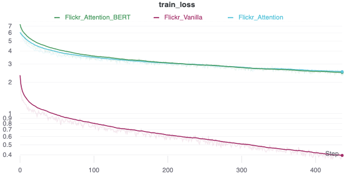

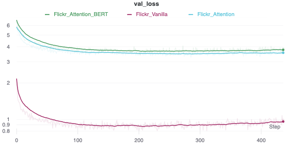

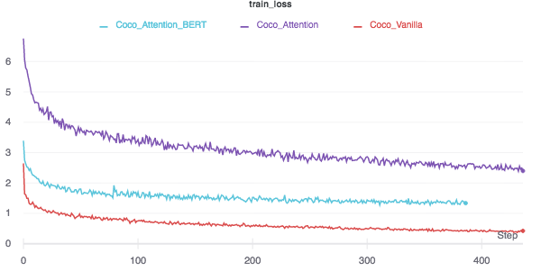

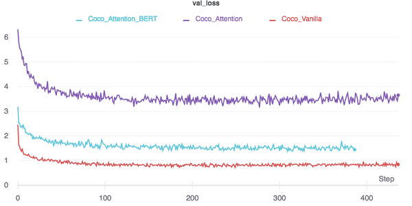

## Quantitative Analysis:<a id="quantitative-analysis"></a>

We report our results for evaluating the image captioning model on COCO and Flickr8k datasets using BLEU score. [Table](#bleu_score_table) shows the BLEU score with 1,2,3 and 4-grams for both our vanilla and attention models trained over COCO and Flickr8k datasets.

In search API to fetch top-5 relevant images for a given query we use the following metrics.

1.  **BLEU-Score**: We used BLEU-score as a similarity metric, where we take top 5 generated captions from an image and compute the BLEU score against the user given query. We return the results with top-5 BLEU scores. In this approach we also experimented with BLEU-1, BLEU-2, BLEU-3, BLEU-4, n-grams and found that BLEU-1 and BLEU-2 give the best results.

2.  **Weighted Cosine Similarity:** In this approach we compute the embeddings the user query and caption generated by our model using the learned embedding layer. The embeddings are a 2D tensor of shape (caption length × embed dimension). Now for each caption in our database, we compute the matrix multiplication of the query's embedding with the caption's embedding. For example, if the query length is 3, the caption length is 4 and the embedding length is 768, the query's embedding (Q) would be of size \(3×768\) and the caption's embedding (C) would be of size \(4×768\). We now compute \(Q×C'\) to get a \(3×4\) dimension matrix. We then take a max along the rows of the matrix to get \(3×1\) vector which represents the similarity of the query and the caption. We then weight the obtained vector by inverse word-frequency and then finally we sum it up to obtain a similarity score. The figure below illustrates the process. In the figure "A dog is sleeping" is the generated caption and "Dog is running" is user given query.


<a id="bleu_score_table"></a>

| BLEU Scores         | Flickr8k |        |        |        | MS-COCO |        |        |        |
|---------------------|----------|--------|--------|--------|---------|--------|--------|--------|
| Architecture        |   BLEU-1 | BLEU-2 | BLEU-3 | BLEU-4 |  BLEU-1 | BLEU-2 | BLEU-3 | BLEU-4 |
| Vanilla             |    0.506 |  0.304 |  0.191 |  0.121 |   0.622 |  0.412 |  0.281 |  0.200 |
| Attention           |    0.597 |  0.405 |  0.278 |  0.189 |   0.671 |  0.472 |  0.338 |  0.245 |
| Attention with BERT |    0.605 |  0.415 |  0.286 |  0.196 |   0.614 |  0.421 |  0.294 |  0.210 |
| Hard-Attention      |    0.670 |  0.457 |  0.314 |  0.213 |   0.718 |  0.504 |  0.357 |  0.250 |
| Adaptive Attention  |    0.677 |  0.494 |  0.354 |  0.251 |   0.742 |  0.580 |  0.439 |  0.332 |
| Google NIC          |    0.630 |  0.410 |  0.270 |      - |   0.666 |  0.461 |  0.329 |  0.246 |

## Qualitative Analysis<a id="qualitative-analysis"></a>

Based on qualitative analysis of our search results, we tried multiple similarity metrics to find matching images for the search query from our database. In [Appendix](#subsec:searchres) show examples of query results searched on both datasets using captions generated from all three model variants.

-   We first generated search results based on the highest BLEU-1 and BLEU-2 score calculated between the query and the predicted captions for each image. Since we are storing five predicted captions per image, the summation of BLEU scores with all predicted captions of the image was taken to be the similarity score of the image with the query. The major drawback in this method was the equal weightage being given to "filler" words in the query like prepositions and conjunctions. This sometimes inflated the score of long but irrelevant captions in the database and led to many irrelevant results being thrown out along with relevant ones.

-   To avoid above drawback, we filtered all "stopwords" from the query and captions before computing BLEU score. This removed filler words from the comparison and significantly improved search results.

-   On further inspection, we observed that for good results we needed to give more importance to the rarely occurring words in our corpus as compared to more commonly occurring words. For example, in a query like "A person sitting with a laptop", "person" is a very common word present in many captions but "laptop" is a rarer word. Our current metrics give equal importance to the two words, throwing results with just a person in them if it could not find both person and laptop. However, we consider results containing a laptop to be more relevant in this case. Hence, we also multiplied "term weightages" with count of common unigrams while calculating BLEU scores. Term weightages were calculated from the term counts (TC) of each word in the test corpus as follows:  This gave us significantly better search results.

-   One drawback still remaining in these methods is that we are looking for common words between query and captions, but any words with similar meaning that could also give relevant results are being ignored. In order to capture this similarity, we used the inner product of the BERT embeddings of the two sentences, as the similarity score instead of BLEU score. After applying term weightage to this method as well, we observe good search results.

In section [Search Results](#subsec:searchres), we show the results for "Search by image" API. The input image is randomly picked from google. We see an image with dolphins being returned in the results as the model has predicted its caption as "A man surfing on a wave".

# Conclusion<a id="conclusion"></a>

In this project we started out with the aim of retrieving images based on textual queries whilst treating images as first class citizens rather than relying on meta-data of an image. We experimented with various image captioning models namely Vanilla CNN-LSTM network, CNN-LSTM with attention, CNN-LSTM using BERT embeddings. We evaluated the quality of captions generated by each of the model using BLEU score which we reported in table [Blue Scores](#bleu_score_table). Scores obtained by our models were fairly close to the referred models. We then implemented a Search API which given a user input query returned top 5 relevant images. We used two metrics at the core of our search API, BLEU-Score and cosine similarity. We used these scores with and without term weights and discovered that results obtained by weighted scores were much better than normal BLEU-score or cosine similarity. Within various n-grams of BLEU score, BLEU-1 and BLEU-2 gave the best results. As an addition we extended the textual search to incorporate image based search. We observed that the quality of the image based search depends on the quality of the captions returned by the captiong model.

# Appendices<a id="appendices"></a>

## Search results<a id="subsec:searchres"></a>
### Coco Vanilla Results
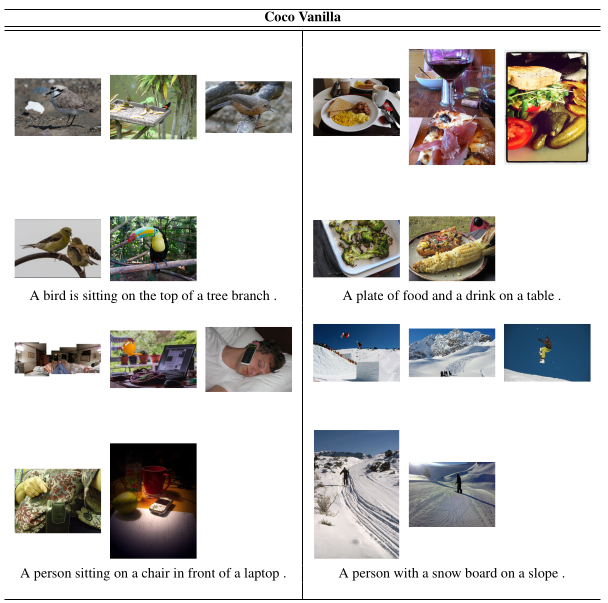
### Coco Attention Results
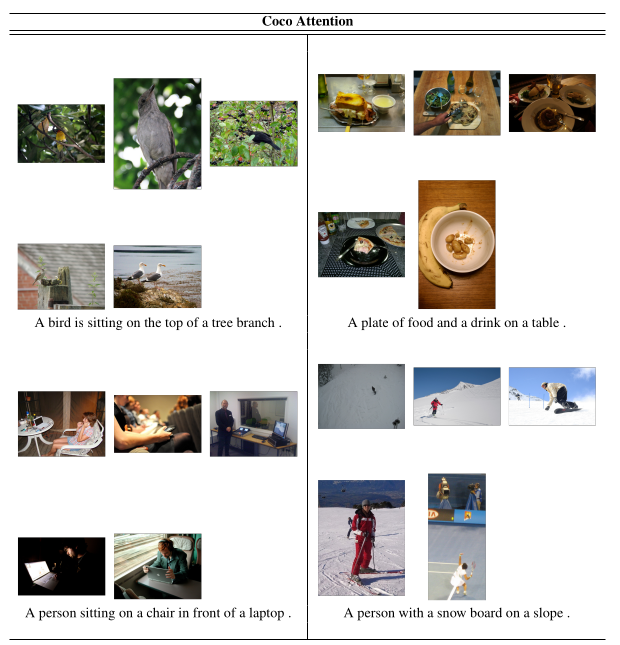
### Coco Attention with BERT Results
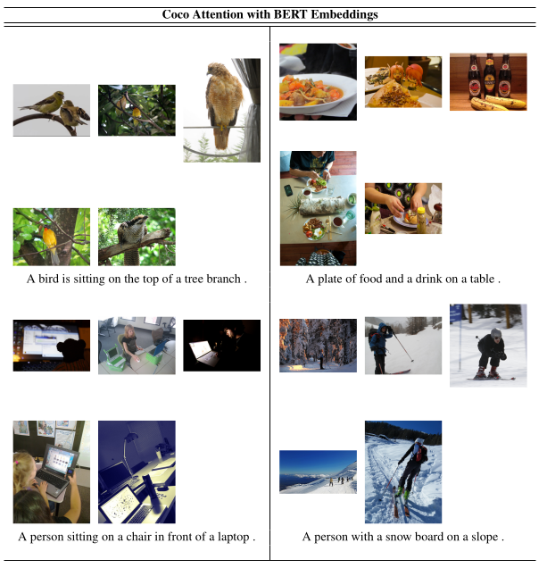
### Flickr Vanilla Results
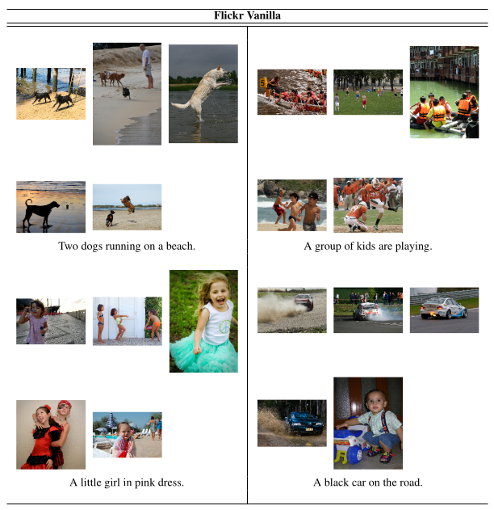
### Flickr Attention Results
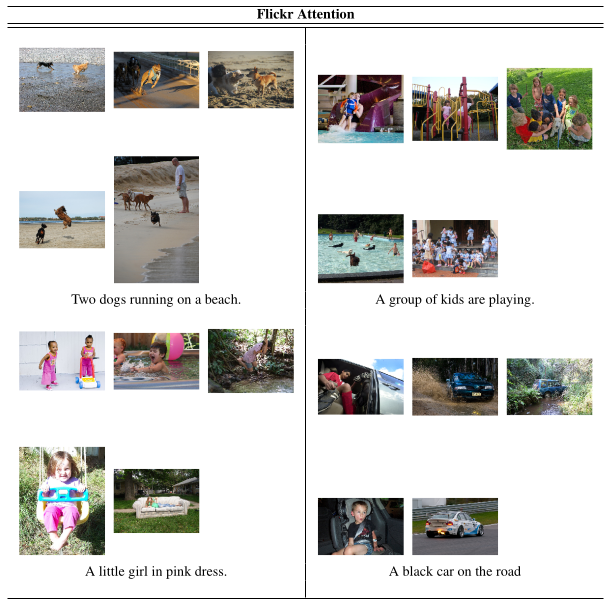
### Flickr Attention with BERT Results
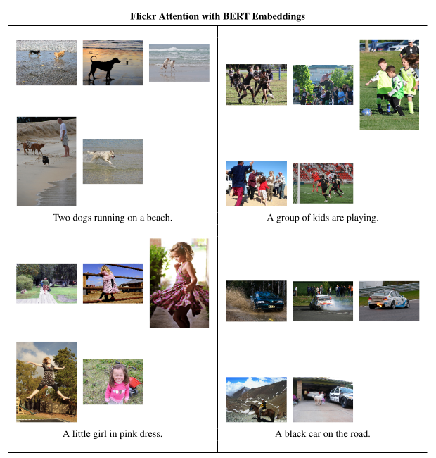

## Computing Infrastructure<a id="computing-infrastructure"></a>

The computing infrastructure used for training and running the models described in the paper was 1 NVIDIA Tesla K80 GPU.

## Runtime<a id="runtime"></a>

The average training time for the model on each combination of hyperparameters was roughly 7 hours for 20 epochs.

## Source Code<a id="source-code"></a>

See below for details on building and reproducing the results.

# Code #

The repository is split into several modules as described below:
* `bert`: Contains the pre-trained BERT loader module
* `captioning`: The main directory containing the models and training code
  * `captioning/captioning_config.py`: The main configuration file to control
    various parameters.
  * `captioning/main.py`: The entry point for testing and evaluation
  * `captioning/train.py`: Main training code
  * `captioning/views.py`: Flask server UI
  * `captioning/architecture/`: Contains the various encode and decoder
    architectures used

# Setup #

Install requirements for the project
```bash
$ pip install -r requirements.txt
```
Run the following commands to fetch the flickr and coco data.
```bash
$ ./captioning/fetch_flickr_data.sh
$ ./captioning/fetch_coco_data.sh
```

# Configure the training parameters #

The file `captioning/captioning_config.py` contains all the parameters used to
configure training, validation and testing. The most important ones are:
```python
self.dataset_type = "flickr8k"                      # Set dataset type [flickr8k, coco]
self.enable_wandb = False                           # Switch to enable/diable wandb logging
self.verbose = False                                # Verbose Flag to print stats
self.enable_bert = True                             # enable bert embeddings in attention model
self.arch_name = "attention"                        # Set architecture type [vanilla, attention]
...
self.encoder_prefix = "encoder_flickr_attn_bert"    # Prefix for encoder model
self.decoder_prefix = "decoder_flickr_attn_bert"    # Prefix for decoder model
...
self.load_from_file = False                         # switch to toggle loading existing model.
self.run_training = True                            # Run Train
self.run_prediction = False                         # Run Predict
self.beam_size = 5                                  # Beam Size for Beam Search
self.image_search_dir = os.path.join(
self.data_dir, "imagesearch"
)                                                   # Image Search Directory path
```


# Training #

To start the training set the `self.run_training` parameter to `True` and run 
the following command:
```bash
$ ipython captioning/main.py
```
The code checks for availability of cuda and uses cuda if available.
## Inference
Inference can be run from command line by set the `self.run_training` parameter 
to `False` and the `self.run_prediction` parameter to `True` and run the 
`main.py` file as given in training.
## Searching
### Setting up the search infrastructure
The below sections require a database of predicted captions which can be prepared as follows:

Start the flask server:
```bash
$ ipython wsgi.py
```
Naviate to the url [Swagger UI](http://localhost:5000/swagger-ui/). Now click on 
populate > Try it out. Enter the model_name as the one set in the
`self.encoder_prefix` configuration parameter. The valid values for `set` is 
train, val or test corresponding to the data that you want to populate the
database with.

Now start Jupyter notebook:
```bash
$ jupyter notebook
```

## Searching by query ##

Configure the queries list and run the jupyter notebook cells to fetch the results.

## Searching by image ##

Download a set of images and store them in the directory configured in the
`self.image_search_dir` parameter. List the names of the images in the directory
in the `image_paths` array in the jupyter notebook and run the cells to fetch
similar images.
